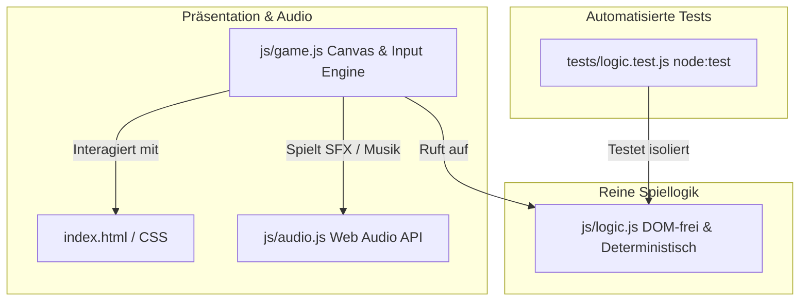

# 🌆 Cloud Runner — Entwickler-Handbuch & Projektstatus

Dieses Dokument dient als technischer Leitfaden und Onboarding-Handbuch für Entwickler, die **„Cloud Runner“** verstehen, warten oder um neue Features erweitern möchten.

---

## 1. Technischer Rahmen & Stack

- **Stack:** Reines **HTML5 Canvas**, **CSS3**, **Modernes JavaScript (ES2020+)**.
- **Zero Dependencies:** Keine externen Bibliotheken oder Frameworks (kein React, Vue, Phaser, jQuery, GSAP etc.).
- **Zero Assets:**
  - Alle Grafiken werden prozedural auf dem `<canvas>` gezeichnet (inkl. Offscreen-Texturbaking für stabile 60+ FPS).
  - Alle Soundeffekte und die Synthwave-Hintergrundmusik werden zur Laufzeit über die **Web Audio API** synthetisiert.
- **Testing:** Integrierter Node.js Test-Runner (`node:test` und `node:assert/strict`).
- **Persistenz:** Clientseitig im `localStorage` des Browsers (`cloudrunner_highscores`, `cloudrunner_muted`).
- **Deployment:** Statisches Hosting (optimiert für **Cloudflare Pages**, GitHub Pages oder jeden statischen Webserver).

---

## 2. Projekt- & Dateistruktur

```text
/
├── index.html           # Semantische HTML-Struktur, HUD, Canvas-Viewport & Modals
├── css/
│   └── style.css        # Cyberpunk-Design (Neon Cyan/Pink/Gelb), Responsive Layouts, Touch-Controls
├── js/
│   ├── logic.js         # Reine, DOM-freie Spiellogik & Mathe (testbar in Node.js)
│   ├── audio.js         # Web Audio API Synthesizer (SFX + 124 BPM Synthwave-Musikloop)
│   └── game.js          # Canvas-Renderer, Parallaxe, Objekt-Pooling, Input & Game Loop
├── tests/
│   └── logic.test.js    # Unit-Tests für logic.js (46 Tests via node --test)
├── package.json         # ES-Modul-Definition ("type": "module") und Test-Befehl ("npm test")
├── README.md            # Allgemeine Spiel- und Deployment-Dokumentation
└── DEVELOPMENT.md       # Technisches Entwickler-Handbuch (dieses Dokument)
```

---

## 3. Architektur & Modul-Trennung

Das Projekt folgt einer strikten Schichtentrennung:



### A. Reine Spiellogik ([`js/logic.js`](file:///home/edgar/Videos/cloudrunner/js/logic.js))
*100% DOM-unabhängige, deterministische Funktionen:*
- `GAME_CONFIG`: Zentrale Konfiguration (Geschwindigkeiten, Schwerkraft, Sprungkraft, Leben-Caps etc.).
- `checkCollision(a, b)`: AABB-Kollisionsprüfung mit Hitbox-Padding.
- `updateDiscCollection(discs, lives, maxLives, discsPerLife)`: Verwaltet den 20-Disc-Zähler, vergibt Extraleben bis zum Cap von maximal 5 Leben und setzt den Zähler zurück.
- `checkPlatformLanding(player, prevY, platform)`: One-Way-Landephysik für schwebende Plattformen (nur Landung von oben bei fallender Bewegung).
- `checkPlayerInChasm(player, chasm, groundY)`: Prüft, ob der Spieler in eine Bodenlücke gefallen ist.
- `calculateSafeChasmWidth(speed)` & `calculateMaxJumpDistance(...)`: Physikbasierte Berechnung maximal überspringbarer Abgrundbreiten.
- `getDayNightCycle(elapsedSeconds, duration)`: Berechnet den 90s-Tag-Nacht-Zyklus (Farben, Sonnen-/Mond-Alpha, Neon-Intensität $0.0 \to 1.0$).
- `calculateGameSpeed(...)` & `calculateSpawnInterval(...)`: Progressive Schwierigkeitskurve über die Spielzeit.
- `updateHighScores(currentScores, newEntry, maxEntries)` & `validatePlayerName(name)`: Validierung und Sortierung der Highscores.

### B. Audio-Engine ([`js/audio.js`](file:///home/edgar/Videos/cloudrunner/js/audio.js))
*Web Audio API Synthesizer (Singleton `soundEngine`):*
- **SFX:**
  - `playJump()`: Aufsteigender Frequenz-Chirp (Square/Triangle).
  - `playDoubleJump()`: Höherer Oktav-Doppel-Chirp.
  - `playDiscPickup()`: Glitzernder C6-G6 Chime.
  - `playExtraLife()`: Triumphal-aufsteigendes Fanfaren-Arpeggio.
  - `playHurt()`: Punchiger Impact-Drop + Rausch-Burst.
  - `playMilestone()`: Cyber-Glocken-Arpeggio bei 10er-Streaks.
  - `playGameOver()`: Dystopische absteigende Sawtooth-Drohne.
- **Musik:** 124 BPM Synthwave-Loop mit Kick, Snare, Hi-Hat, 16tel-Bassline und Lead-Melodie.
- **Autoplay-Konformität:** Der `AudioContext` wird erst bei der ersten Nutzerinteraktion (Klick, Tap, Leertaste) aufgeweckt.

### C. Canvas-Engine & Game Loop ([`js/game.js`](file:///home/edgar/Videos/cloudrunner/js/game.js))
*Haupt-Renderer und Zustandsverwaltung:*
- **Delta-Time-Loop:** Bildwiederholraten-unabhängige Physik via `requestAnimationFrame` (`dt = (now - lastFrameTime) / 1000`).
- **Objekt-Pooling:** Pre-Allokation von Hindernissen, Discs, Plattformen, Abgründen und Partikeln zur Vermeidung von Garbage-Collection-Rucklern.
- **Offscreen-Parallaxe:** Die Skyline wird einmalig beim Laden auf zwei Offscreen-Canvases vorberechnet (Basis-Silhouetten & Neon-Leuchtelemente). Das Scrolling erfolgt per exaktem Modulo ohne Sprünge oder Nachladeruckler.
- **Adaptive Viewport-Architektur:**
  - *Landscape (Desktop / Querformat):* Virtuelle Auflösung $960 \times 540$, `groundY = 460`, `player.x = 120`.
  - *Portrait (Mobilgeräte / Hochformat):* Virtuelle Auflösung $540 \times \text{dynamisch}$, `groundY = vHeight - 160`, `player.x = 75`.
- **Highscore-Ablauf:** Eingabe nach Game Over ist auf genau einen Speicherversuch beschränkt (`scoreSaved = true`), danach automatische Rückkehr zum Startmenü.
- **Startmenü-Rangliste:** Der Button `🏆 RANGLISTE` im Startmenü öffnet das Leaderboard-Modal.

---

## 4. Spielmechaniken im Überblick

| Mechanik / Element | Spezifikation |
| :--- | :--- |
| **Spielfigur & Physik** | Läuft automatisch nach rechts. Sprung per Leertaste / Pfeil-Oben / W / Tap / Touch-Button. Doppelsprung in der Luft. Schwerkraft ($1850 \text{ px/s}^2$), Sprungkraft ($-680 \text{ px/s}$). |
| **Cyber-Slide** | Sliden per `Pfeil-Unten` / `S` / Swipe-Down / Touch-Button `SLIDE`. Reduziert Hitbox-Höhe von 56px auf 28px für 0.65s mit Funken-Partikeln. Erlaubt Durchrutschen unter High-Laser-Gates. |
| **Power-Ups** | **1. 🛡️ Neon-Schild**: Absorbiert 1 Treffer ohne Leben-Verlust. **2. 🧲 Disc-Magnet**: Zieht Discs im 220px-Radius magnetisch an (8s). **3. ⚡ Overdrive**: Hyper-Speed (+140px/s), Unverwundbarkeit, Hindernis-Zerstörung & Doppel-Score (4.5s). |
| **Air-Combos** | Sammeln mehrerer Discs in der Luft ohne Bodenberührung erhöht den Multiplikator von $1.5\times$ bis $3.0\times$. Beim Landen wird der Combo-Score gutgeschrieben. |
| **Leben & Schaden** | Start mit 3 Leben, erweiterbar auf maximal 5 Leben. Treffer/Absturz zieht 1 Leben ab, erzeugt Screen-Shake, Screen-Flash, Hurt-Sound und 1,8s Unverwundbarkeit. |
| **Sammel-Discs (CDs)** | Erscheinen einzeln oder in Gruppen (2–5 Stück als Reihe, Spalte oder Sprungbogen). **20 Discs = +1 Extraleben (Cap bei 5)**. Zähler wird bei 20 und bei jedem Neustart auf 0 zurückgesetzt. |
| **Plattformen** | Schwebende Plattformen (Höhe 45–95 px). Spieler kann von oben darauf landen, laufen und abspringen. Höhen und Distanzen sind physikalisch garantiert erreichbar. |
| **Abgründe (Chasms)** | Bodenlücken mit Warnmarkierungen und Laser-/Void-Boden. Breiten sind physikbasiert begrenzt (max. 55% der Sprungweite). Sturz zieht 1 Leben ab und setzt den Spieler sicher auf die Fahrbahn zurück. |
| **Hindernisse** | **1. Cyber-Barriere** (Boden), **2. Laser-Gate** (hoch zum Überspringen), **3. High-Laser-Gate** (hängend, erfordert Slide), **4. Drohne** (schwebend mit Sinus-Bewegung und dynamischem **Neon-Glow** in der Dunkelheit). |
| **Tag-Nacht-Zyklus** | Start bei **Mittag** (warm/hell), wandelt sich über **90 Sekunden** kontinuierlich zur **Cyberpunk-Nacht** (Fenster/Schilder/Drohnen leuchten neonfarben). |

---

## 5. Entwickler-Workflow & Tests

### Tests ausführen
```bash
# Über npm (führt node --test aus):
npm test

# Oder direkt über Node.js:
node --test
```
Alle 57 Unit-Tests decken Kollisionsprüfungen, Disc-Zähler, Plattform-Landephysik, Abgrund-Berechnungen, Cyber-Slide, Power-Ups (Schild, Magnet, Overdrive), Air-Combos, Highscores und Tag-Nacht-Interpolation ab.

### Lokales Ausführen & Testen
```bash
# Mit Node.js (z. B. npx serve):
npx serve .

# Oder mit Python 3:
python3 -m http.server 8080
```
Anschließend `http://localhost:8080` im Browser öffnen.

---

## 6. Best Practices für die Weiterentwicklung

1. **Logik zuerst in `logic.js` implementieren:**
   Neue Spielregeln, Zähler, Berechnungen oder Physik-Checks sollten immer als reine Funktion ohne DOM-Zugriff in [`js/logic.js`](file:///home/edgar/Videos/cloudrunner/js/logic.js) geschrieben werden.
2. **Unit-Tests in `tests/logic.test.js` ergänzen:**
   Für jede neue Spielfunktion sollten positive Fälle und Randfälle in [`tests/logic.test.js`](file:///home/edgar/Videos/cloudrunner/tests/logic.test.js) getestet werden.
3. **Audio-Effekte in `audio.js` ergänzen:**
   Neue Klänge sollten als prozedurale Web Audio API Methoden in [`js/audio.js`](file:///home/edgar/Videos/cloudrunner/js/audio.js) ergänzt werden.
4. **Visualisierung in `game.js` anbinden:**
   Erst nach erfolgreichen Tests wird die visuelle Darstellung und das Spawning in [`js/game.js`](file:///home/edgar/Videos/cloudrunner/js/game.js) eingebunden.

---

## 7. Potenzielle Erweiterungsideen

- **Power-ups:** Magnet für Discs, Schutzschild gegen Hindernisse oder temporärer Turbo/Slow-Motion-Modus.
- **Online-Highscores:** Anbindung an ein serverloses Backend (z. B. Cloudflare Workers mit D1 oder KV) für globale Leaderboards.
- **Boss-Begegnungen:** Riesige Cyber-Drohne oder Laser-Mechs nach jeweils 180 Sekunden Spielzeit.
- **Kosmetische Freischaltungen:** Runner-Skins oder alternative Visier-Farben, die mit gesammelten Discs freigeschaltet werden können.
